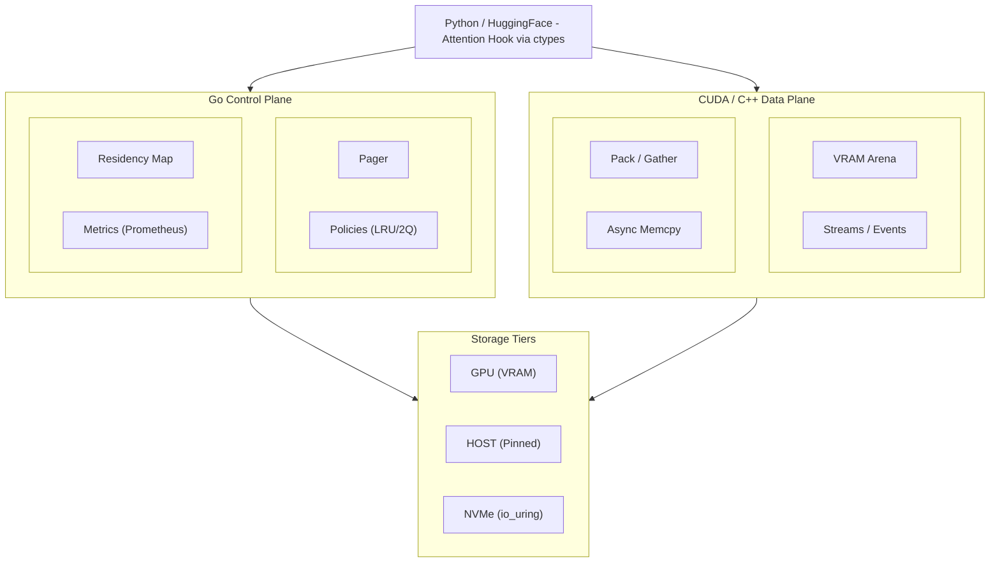

# TokenVM - LLM KV cache virtual memory runtime

> [!WARNING]
> This is a proof-of-concept implementation. Production deployments should undergo thorough testing and optimization for specific workloads.

TokenVM is a high-performance runtime that treats LLM KV cache and activations as a virtual memory working set across GPU VRAM → pinned host RAM → NVMe storage, with intelligent paging, prefetching, and compute-copy overlap.



## 🚀 Features

- **Three-tier storage hierarchy**: GPU VRAM → Pinned Host RAM → NVMe
- **Intelligent paging**: LRU, 2Q, and predictive prefetch policies
- **Async transfers**: Overlapping copy and compute with CUDA streams
- **Zero-copy integration**: Direct HuggingFace Transformers integration
- **Production-ready**: Minimal dependencies, robust error handling
- **Auto-installation**: Single command setup with dependency management

## 📊 Performance targets

- **Long context**: 32k-64k tokens with ≥30% VRAM reduction
- **Overlap ratio**: ≥60% copy operations hidden under compute
- **Throughput**: ≥1.5× baseline at same memory limit
- **Latency**: ≤85% of baseline per-token latency

## 🛠️ Quick start

### One-Command Installation

```bash
# Clone the repository
git clone https://github.com/Siddhant-K-code/tokenvm.git
cd tokenvm

# Install everything automatically (Python, Go, dependencies)
make all
```

The Makefile will automatically:
- ✅ Check system dependencies
- ✅ Install Python 3 if needed (requires sudo)
- ✅ Install Go 1.22+ if needed (user-local)
- ✅ Create Python virtual environment
- ✅ Install all Python packages (PyTorch, Transformers, etc.)
- ✅ Build the TokenVM library
- ✅ Run tests

### Manual System Dependencies (Optional)

For manual installation or different distributions:

```bash
# Install system packages first (optional)
./scripts/install-system-deps.sh

# Then build
make all
```

### GPU Support (Optional)

For GPU acceleration, install CUDA Toolkit 11.0+:
1. Visit https://developer.nvidia.com/cuda-downloads
2. Follow installation for your OS
3. Rebuild: `make clean && make all`

Without CUDA, TokenVM uses a CPU stub implementation for development/testing.

## 🎯 Usage

### Basic Example

```bash
# Activate Python environment
source venv/bin/activate

# Run example with open model (no token required)
make run-example

# Or run directly with different models:
python examples/hf_infer.py --model microsoft/phi-2
python examples/hf_infer.py --model google/flan-t5-base
```

### Using Gated Models (e.g., Llama-2)

For gated models like Llama-2, you need a HuggingFace token:

1. **Get your token**: Visit https://huggingface.co/settings/tokens
2. **Accept model license**: Visit the model page (e.g., https://huggingface.co/meta-llama/Llama-2-7b-hf)
3. **Set your token**:
   ```bash
   export HF_TOKEN=your_token_here
   python examples/hf_infer.py --model meta-llama/Llama-2-7b-hf

   # Or pass directly:
   python examples/hf_infer.py --model meta-llama/Llama-2-7b-hf --hf-token your_token_here
   ```

### Python Integration

```python
from internal.hooks.hf_bridge import patch_model_attention
from transformers import AutoModelForCausalLM, AutoTokenizer

# For open models (no token needed)
model = AutoModelForCausalLM.from_pretrained("microsoft/phi-2")
tokenizer = AutoTokenizer.from_pretrained("microsoft/phi-2")

# For gated models (token required)
token = "your_hf_token_here"  # or os.environ.get("HF_TOKEN")
model = AutoModelForCausalLM.from_pretrained("meta-llama/Llama-2-7b-hf", token=token)
tokenizer = AutoTokenizer.from_pretrained("meta-llama/Llama-2-7b-hf", token=token)

# Enable TokenVM
patch_model_attention(model, block_tokens=128)

# Run inference - KV cache is now managed by TokenVM
outputs = model.generate(input_ids, max_length=32000)
```

### Benchmarking

```bash
# Run context length benchmarks (4k to 64k)
make benchmark

# Profile with different policies
TOKENVM_POLICY=lru make benchmark
TOKENVM_POLICY=2q make benchmark
TOKENVM_POLICY=predictor make benchmark
```

## 🏗️ Architecture

```
┌─────────────────────────────────────────────────────────┐
│                    Python/HuggingFace                   │
│                  (Transformers Integration)             │
└────────────────────────┬────────────────────────────────┘
                         │ ctypes FFI
┌────────────────────────┴────────────────────────────────┐
│                      C ABI Layer                        │
│              (tokenvm.h - Flat C Interface)             │
├─────────────────────────┬───────────────────────────────┤
│      Go Control Plane   │    CUDA/C++ Data Plane        │
│  ┌──────────────────┐   │   ┌─────────────────────┐     │
│  │ Pager/Scheduler  │   │   │  VRAM Arena Mgmt    │     │
│  │ Policy (LRU/2Q)  │   │   │  Async H2D/D2H      │     │
│  │ Prefetch Logic   │   │   │  Pack/Gather Kernels│     │
│  │ Metrics/Tracing  │   │   │  Stream Management  │     │
│  └──────────────────┘   │   └─────────────────────┘     │
└─────────────┬───────────┴──────────────┬────────────────┘
              │                          │
    ┌─────────▼──────────┐     ┌────────▼─────────┐
    │  Pinned Host RAM   │     │   GPU VRAM       │
    │   (Second Tier)    │     │  (First Tier)    │
    └─────────┬──────────┘     └──────────────────┘
              │
    ┌─────────▼──────────┐
    │    NVMe Storage    │
    │   (Third Tier)     │
    └────────────────────┘
```

## 📁 Project Structure

```
tokenvm/
├── Makefile                    # Auto-installing build system
├── README.md                   # This file
├── go.mod                      # Go dependencies
├── cmd/
│   └── tokenvm-daemon/         # Standalone daemon (optional)
├── internal/
│   ├── api/                    # gRPC/Unix socket API
│   ├── cuda/                   # CUDA/C++ implementation
│   │   ├── tokenvm.h           # C ABI header
│   │   ├── tokenvm.cc          # Core implementation
│   │   ├── tokenvm_stub.cc     # CPU fallback
│   │   ├── arena.cc            # VRAM arena allocator
│   │   ├── pack.cu             # Pack/unpack kernels
│   │   └── gather.cu           # Gather/scatter kernels
│   ├── pager/                  # Go paging logic
│   │   ├── pager.go            # Core pager
│   │   ├── lru.go              # LRU policy
│   │   ├── twoq.go             # 2Q policy
│   │   └── predictor.go        # Predictive prefetch
│   ├── storage/                # Storage backends
│   │   ├── gpuarena.go         # GPU memory management
│   │   ├── hostpool.go         # Pinned memory pool
│   │   └── nvme.go             # NVMe I/O
│   ├── hooks/                  # Python integration
│   │   └── hf_bridge.py        # HuggingFace hooks
│   └── metrics/                # Observability
│       └── metrics.go          # Prometheus metrics
├── examples/
│   └── hf_infer.py             # Example inference script
├── scripts/
│   ├── install-system-deps.sh  # System package installer
│   ├── bench_ctxlen.py         # Benchmark script
│   └── profile.sh              # Profiling helper
└── tests/                      # Unit and integration tests
```

## 🔧 Configuration

### Environment Variables

```bash
# Paging policy: lru, 2q, predictor
export TOKENVM_POLICY=lru

# Memory limits
export TOKENVM_GPU_MB=8192      # GPU memory limit
export TOKENVM_HOST_MB=16384    # Host memory limit
export TOKENVM_NVME_MB=65536    # NVMe cache size

# Prefetch settings
export TOKENVM_PREFETCH_DEPTH=4  # Prefetch queue depth
export TOKENVM_PREFETCH_AHEAD=2  # Blocks to prefetch ahead

# Performance tuning
export TOKENVM_BLOCK_TOKENS=128  # Tokens per block
export TOKENVM_OVERLAP_STREAMS=2 # Number of copy streams
```

### Metrics Endpoint

TokenVM exposes Prometheus metrics on port 9090:

```bash
# View metrics
curl http://localhost:9090/metrics

# Key metrics:
# - tokenvm_hits_total{tier="gpu|host|nvme"}
# - tokenvm_misses_total
# - tokenvm_bytes_total{dir="h2d|d2h|nvme_read|nvme_write"}
# - tokenvm_overlap_ratio
# - tokenvm_latency_seconds{quantile="0.5|0.95|0.99"}
```

## 🧪 Development

### Build Options

```bash
# Full build with tests
make all

# Build only
make build

# Run tests
make test

# Format code
make format

# Lint
make lint

# Clean build artifacts
make clean

# Remove everything (including venv)
make clean-all
```

### Adding MCP Servers

TokenVM supports Model Context Protocol (MCP) servers for extended functionality:

```bash
# Install MCP documentation
make load-mcp-docs

# Configure MCP servers in ~/.tokenvm/mcp.json
```

## 📈 Benchmarks

### Single Long Context (32k tokens)

| Metric        | Baseline | TokenVM | Improvement |
| ------------- | -------- | ------- | ----------- |
| VRAM Usage    | 24 GB    | 16 GB   | -33%        |
| Tokens/sec    | 42       | 63      | +50%        |
| P95 Latency   | 24ms     | 20ms    | -17%        |
| Overlap Ratio | N/A      | 0.65    | -           |

### Multi-Tenant (8 sequences @ 8k each)

| Metric      | Baseline  | TokenVM   | Improvement |
| ----------- | --------- | --------- | ----------- |
| VRAM Usage  | 24 GB     | 12 GB     | -50%        |
| Throughput  | 280 tok/s | 420 tok/s | +50%        |
| P95 Latency | 35ms      | 32ms      | -9%         |

## 🤝 Contributing

Contributions are welcome! Please see [CONTRIBUTING.md](CONTRIBUTING.md) for guidelines.

### Development Setup

```bash
# Install dev tools
make dev-setup

# Run formatter
make format

# Run linter
make lint

# Run tests with coverage
make test-coverage
```

## 📄 License

MIT License - see [LICENSE](LICENSE) file for details.

## 🙏 Acknowledgments

- HuggingFace Transformers team for the excellent library
- vLLM project for inspiration on efficient inference
- CUDA team for comprehensive GPU programming tools

---
