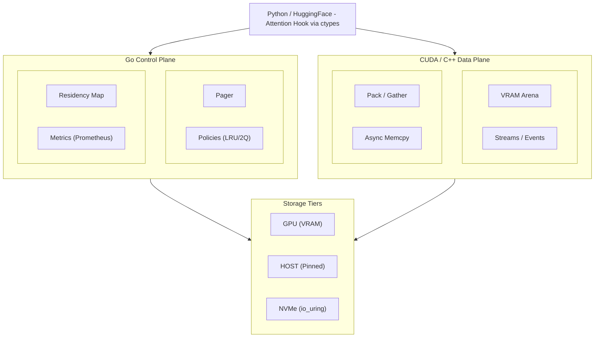

# PagedLLM: Memory-Virtualized Inference Runtime for Transformers
## Product/Proof-of-Concept Development Plan

## 1. Executive Summary

### Vision
Build a production-ready inference runtime that enables running large language models on memory-constrained GPUs through intelligent memory virtualization, achieving near-native performance while supporting 10x larger contexts than available VRAM.

### Value Proposition
- **For Enterprises:** Run larger models on existing hardware
- **For Researchers:** Experiment with extreme context lengths
- **For Startups:** Reduce infrastructure costs by 70%
- **For Edge Deployment:** Enable LLMs on consumer GPUs

### Key Differentiators
- First unified memory virtualization for both KV cache AND activations
- Predictive prefetching based on attention patterns
- Zero-copy integration with existing PyTorch/HuggingFace models
- Production-grade reliability with fault tolerance

## 2. System Design

### 2.1 Architecture Overview



### 2.2 Core Components

#### 2.2.1 Memory Manager
**Responsibilities:**
- Virtual address space management
- Page allocation and deallocation
- Tier management (VRAM → Host → NVMe)
- Memory pressure handling

**Key Classes:**
```python
class MemoryManager:
    def __init__(self, config: MemoryConfig):
        self.vram_pool = VRAMPool(config.vram_size)
        self.host_pool = HostMemPool(config.host_size)
        self.nvme_pool = NVMePool(config.nvme_path)
        self.page_table = PageTable()

    def allocate(self, size: int, hint: MemoryHint) -> VirtualAddress
    def deallocate(self, addr: VirtualAddress) -> None
    def ensure_resident(self, addr: VirtualAddress) -> PhysicalAddress
    def evict_pages(self, num_pages: int) -> List[Page]
```

#### 2.2.2 Scheduler & Executor
**Responsibilities:**
- Operation scheduling
- Dependency tracking
- Overlap compute with memory transfers
- Stream management

**Key Classes:**
```python
class Scheduler:
    def __init__(self, num_streams: int = 4):
        self.compute_stream = cuda.Stream()
        self.transfer_streams = [cuda.Stream() for _ in range(num_streams)]
        self.operation_queue = PriorityQueue()

    def schedule_operation(self, op: Operation) -> Future
    def execute_batch(self, ops: List[Operation]) -> None
    def wait_for_completion(self) -> None
```

#### 2.2.3 Transfer Engine
**Responsibilities:**
- Asynchronous memory transfers
- Compression/decompression
- Bandwidth optimization
- Multi-path transfers

**Implementation:**
```python
class TransferEngine:
    def __init__(self):
        self.dma_engine = DMAEngine()
        self.compressor = LZ4Compressor()

    async def transfer_async(
        self,
        src: MemoryLocation,
        dst: MemoryLocation,
        size: int,
        compress: bool = True
    ) -> None:
        if compress and self._should_compress(src, dst):
            data = await self.compressor.compress_async(src, size)
            await self.dma_engine.transfer(data, dst)
            await self.compressor.decompress_async(dst, data)
        else:
            await self.dma_engine.transfer(src, dst, size)
```

#### 2.2.4 Predictive Prefetcher
**Responsibilities:**
- Analyze attention patterns
- Predict future access
- Schedule prefetch operations
- Adaptive learning

**Algorithm:**
```python
class AttentionPredictor:
    def __init__(self, window_size: int = 100):
        self.access_history = deque(maxlen=window_size)
        self.attention_scores = {}

    def record_access(self, layer: int, token_ids: List[int]):
        self.access_history.append((layer, token_ids))

    def predict_next_access(self, current_layer: int) -> List[int]:
        # Use attention scores to predict which tokens
        # will be accessed in the next iteration
        pattern = self._analyze_pattern()
        return self._extrapolate(pattern, current_layer)
```

### 2.3 Integration Points

#### 2.3.1 PyTorch Integration
```python
# Custom autograd function for paged operations
class PagedLinear(torch.autograd.Function):
    @staticmethod
    def forward(ctx, input, weight, bias=None):
        # Ensure weight is resident
        weight_addr = memory_manager.ensure_resident(weight.virtual_addr)
        output = F.linear(input, weight_addr.to_tensor(), bias)
        ctx.save_for_backward(input, weight_addr, bias)
        return output

    @staticmethod
    def backward(ctx, grad_output):
        # Handle gradients with paging
        pass

# Monkey-patch PyTorch modules
def enable_paging():
    torch.nn.Linear.forward = paged_linear_forward
    torch.nn.MultiheadAttention.forward = paged_attention_forward
```

#### 2.3.2 HuggingFace Integration
```python
from transformers import AutoModelForCausalLM
from pagedllm import PagedLLMConfig, enable_paging

# Load model with paging enabled
config = PagedLLMConfig(
    vram_size="24GB",
    host_memory="128GB",
    nvme_path="/mnt/nvme/pagedllm",
    prefetch_strategy="attention_aware"
)

model = AutoModelForCausalLM.from_pretrained("meta-llama/Llama-2-70b")
model = enable_paging(model, config)

# Use normally
output = model.generate(input_ids, max_length=100000)
```

## 3. Technical Stack

### 3.1 Core Technologies

#### Language & Frameworks
- **Primary Language:** Python 3.10+ (high-level API)
- **Performance Critical:** C++/CUDA (kernels and memory management)
- **Deep Learning:** PyTorch 2.0+
- **Kernel Development:** Triton (for custom kernels)

#### Libraries & Tools
- **CUDA Libraries:**
  - cuDNN (optimized operations)
  - NCCL (multi-GPU communication)
  - cuBLAS (linear algebra)
  - CUB (CUDA building blocks)

- **Memory Management:**
  - jemalloc (host memory allocation)
  - CUDA Unified Memory (baseline comparison)
  - SPDK (NVMe optimization)

- **Compression:**
  - LZ4 (fast compression)
  - Zstandard (better ratio)
  - Custom bit-packing for KV cache

#### Development Tools
- **Build System:** CMake + setuptools
- **Testing:** pytest, CUDA-memcheck
- **Profiling:** Nsight Systems, PyTorch Profiler
- **CI/CD:** GitHub Actions, Docker

### 3.2 Custom CUDA Kernels

#### Paged Attention Kernel
```cuda
__global__ void paged_attention_kernel(
    const float* __restrict__ query,      // [batch, heads, seq_len, head_dim]
    const float* __restrict__ key_cache,   // Paged storage
    const float* __restrict__ value_cache, // Paged storage
    const int* __restrict__ page_table,    // Virtual to physical mapping
    float* __restrict__ output,            // [batch, heads, seq_len, head_dim]
    const int seq_len,
    const int head_dim,
    const int page_size
) {
    // Efficient paged attention implementation
    // with coalesced memory access
}
```

#### Async Transfer Kernel
```cuda
__global__ void async_page_transfer(
    void* dst,
    const void* src,
    size_t size,
    cudaStream_t stream
) {
    // Asynchronous memory transfer with
    // overlap of compute and transfer
}
```

### 3.3 Triton Kernels

#### Fused Operations
```python
@triton.jit
def fused_paged_mlp(
    x_ptr, w1_ptr, w2_ptr,
    page_table_ptr,
    output_ptr,
    BLOCK_SIZE: tl.constexpr
):
    """Fused MLP with paging support"""
    # Load from paged memory
    # Compute MLP
    # Store results
```

## 4. Evaluation Milestones

### Milestone 1: Proof of Concept (Week 4)
**Success Criteria:**
- Basic paging system operational
- Can offload and restore tensors
- Overhead < 50% vs native

**Metrics:**
```python
def measure_poc():
    # Measure basic paging overhead
    tensor_size = 1_000_000_000  # 1GB

    # Native baseline
    start = time.time()
    tensor = torch.randn(tensor_size // 4).cuda()
    result = tensor.sum()
    native_time = time.time() - start

    # Paged version
    start = time.time()
    paged_tensor = PagedTensor(tensor_size // 4)
    result = paged_tensor.sum()
    paged_time = time.time() - start

    overhead = (paged_time - native_time) / native_time
    assert overhead < 0.5, f"Overhead {overhead:.2%} exceeds 50%"
```

### Milestone 2: KV Cache Demo (Week 8)
**Success Criteria:**
- Llama-2 7B with 64K context
- Throughput > 50% of baseline
- Memory usage < 24GB

**Demo Script:**
```python
from pagedllm import PagedLlama

model = PagedLlama.from_pretrained("meta-llama/Llama-2-7b")
model.set_memory_limit("24GB")

# Generate with long context
context = "..." * 32000  # 64K tokens
output = model.generate(
    context,
    max_new_tokens=100,
    measure_memory=True
)

print(f"Peak memory: {output.peak_memory_gb:.1f}GB")
print(f"Throughput: {output.tokens_per_second:.1f} tok/s")
```

### Milestone 3: Production Ready (Week 16)
**Success Criteria:**
- Support for 5+ model architectures
- 99.9% reliability over 24h test
- Documentation and tutorials
- Performance within 20% of vLLM

### Milestone 4: Competitive Advantage (Week 20)
**Success Criteria:**
- 1M token context support
- Better than vLLM on 3+ benchmarks
- Multi-GPU linear scaling
- Published benchmarks

## 5. Risk Analysis & Mitigation

### Technical Risks

#### Risk 1: Page Fault Latency
**Impact:** High latency makes system unusable
**Probability:** Medium
**Mitigation:**
- Aggressive prefetching
- Larger page sizes
- Memory pooling
- Fallback to smaller contexts

#### Risk 2: Prediction Accuracy
**Impact:** Poor prefetch accuracy negates benefits
**Probability:** Medium
**Mitigation:**
- Multiple prediction strategies
- Adaptive selection
- Conservative prefetching
- Manual hints API

#### Risk 3: Framework Compatibility
**Impact:** Cannot integrate with existing code
**Probability:** Low
**Mitigation:**
- Multiple integration levels
- Compatibility layer
- Extensive testing
- Gradual rollout

### Business Risks

#### Risk 4: Competition
**Impact:** vLLM or others implement similar features
**Probability:** High
**Mitigation:**
- Fast execution
- Patent filing
- Open source community
- Focus on unique features

#### Risk 5: Adoption
**Impact:** Users don't see value
**Probability:** Medium
**Mitigation:**
- Clear benchmarks
- Easy integration
- Strong documentation
- Reference customers

## 6. Success Metrics

### Technical Metrics
- **Context Length:** 10x increase vs VRAM limit
- **Throughput:** Within 30% of native
- **Latency:** <100ms overhead for TTFT
- **Memory Efficiency:** 90% utilization
- **Prefetch Accuracy:** >85% hit rate

### Product Metrics
- **GitHub Stars:** 1000+ in 6 months
- **Downloads:** 10K+ monthly
- **Contributors:** 20+ active
- **Enterprise Users:** 5+ companies
- **Model Coverage:** 10+ architectures

### Business Metrics
- **Cost Reduction:** 70% infrastructure savings
- **Performance/Dollar:** 3x improvement
- **Time to Market:** 6 months to v1.0
- **Support Tickets:** <5% of users
- **Documentation:** 95% coverage


## Appendix A: Benchmark Suite

```python
class PagedLLMBenchmark:
    def __init__(self):
        self.models = [
            "meta-llama/Llama-2-7b",
            "meta-llama/Llama-2-70b",
            "mistralai/Mixtral-8x7B"
        ]
        self.context_lengths = [2048, 8192, 32768, 131072]
        self.batch_sizes = [1, 4, 8, 16]

    def run_benchmark(self, backend="pagedllm"):
        results = {}
        for model in self.models:
            for context in self.context_lengths:
                for batch in self.batch_sizes:
                    result = self.measure_performance(
                        model, context, batch, backend
                    )
                    results[(model, context, batch)] = result
        return results

    def measure_performance(self, model, context, batch, backend):
        # Load model with specified backend
        # Measure throughput, latency, memory
        # Return metrics
        pass
```

## Appendix B: API Reference

```python
# High-level API
from pagedllm import PagedModel, MemoryConfig

config = MemoryConfig(
    vram_limit="24GB",
    host_memory="128GB",
    nvme_path="/mnt/nvme",
    page_size="128MB",
    prefetch_strategy="attention_aware",
    compression="lz4"
)

model = PagedModel.from_pretrained(
    "meta-llama/Llama-2-70b",
    memory_config=config
)

# Generate with automatic paging
output = model.generate(
    input_ids,
    max_length=100000,
    temperature=0.7
)

# Manual memory management
with model.memory_scope() as scope:
    # Operations within scope share memory pool
    output1 = model.generate(prompt1)
    output2 = model.generate(prompt2)
    # Memory automatically released on scope exit
```

## Appendix C: Installation Guide

```bash
# From PyPI
pip install pagedllm

# From source
git clone https://github.com/pagedllm/pagedllm
cd pagedllm
pip install -e .

# With optional dependencies
pip install pagedllm[enterprise]  # Enterprise features
pip install pagedllm[dev]         # Development tools
pip install pagedllm[benchmark]   # Benchmarking suite

# Docker
docker pull pagedllm/runtime:latest
docker run -it --gpus all pagedllm/runtime

# Verification
python -c "import pagedllm; pagedllm.verify_installation()"
